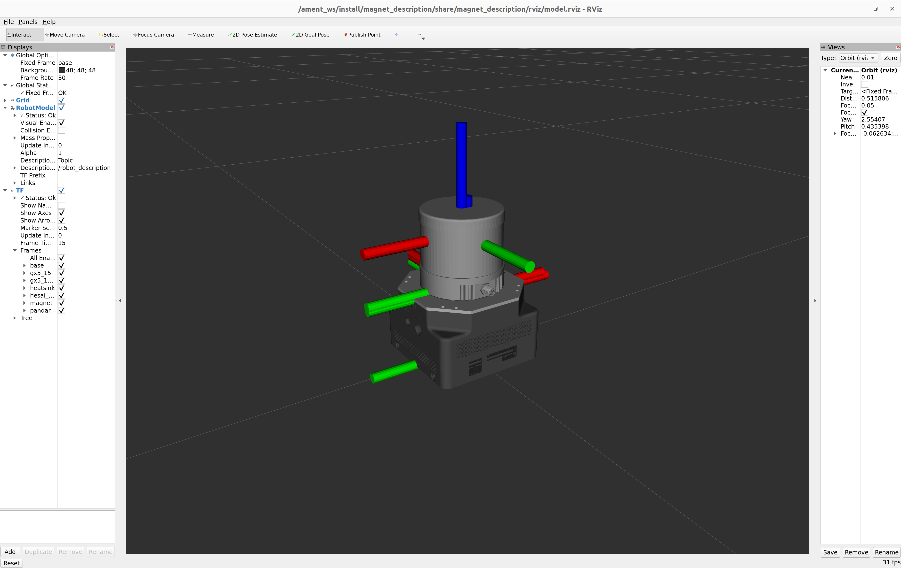

# magnet_description




This package contains a **URDF Xacro description of the Magnet**, a mapping device consisting of a Hesai QT64, a Microstrain GX5-15 and an Intel NUC.


For visualizing the URDF with RViz launch:

```bash
$ ros2 launch magnet_description visualize.launch.py
```

